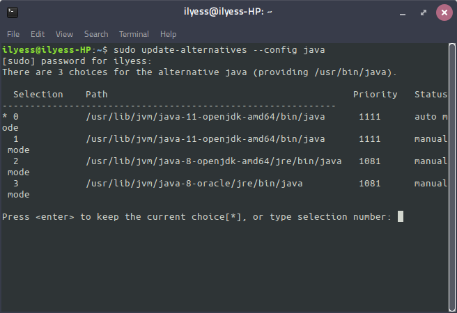

Install

# Install
## Requirements
- access to internet 
- have sudo privileges
- have eclipse already installed

## Installing java 8
### Check java version
before we begin begin check your java version :
````sh
java --version
# expected 
#openjdk version "1.8.0_162"
````
### Installing java 80
````sh
sudo apt update
sudo apt install openjdk-8-jdk -y
````
### Managing java versions :
````sh
sudo update-alternatives --config java
````





Choose the number associated with the **java-8-openjdk** version to use it as the default, or press ENTER to leave the current settings in place.

# Using release 

## Importing project into eclipse
### Getting and extracting archive
````sh
cd ~
wget https://github.com/ilyesAj/sessionu/releases/download/0.1/eclipse_import.zip
````
### Importing project into workspace via UI 
1.     Click File -> Import -> from the Eclipse main menu
2.     Expand General, select **Existing Projects into Workspace**, and click Next
3.     Make sure that **Select Archive File is checked** and browse for VectorProducts.zip and browse for the ZIP file
4.     Click Finish 

## Using Binary
### Executing Binary from eclipse 
right click on src/app/controller.java -> run as -> java application . The expected result is a window like the image below :


### Getting and executing binary from command-line
````sh
cd ~
wget https://github.com/ilyesAj/sessionu/releases/download/0.1/executable.jar
sudo chmod +x executable.jar
java -jar executable.jar
````
## Troubleshoot
- verify build path :
make sure that `json-20190722.jar` and `sqlite-jdbc-3.27.2.1.jar` are in referenced libraries as the picture below : 


**otherwise** : 
    1. right-click on the library (`json-20190722.jar` or `sqlite-jdbc-3.27.2.1.jar`) 
    2. click build path -> add to build path 
    if the option doesn't appear click on configure build path and add manually the two jars with `add external JAR` button
- verify Java runtime environments
    1. click window -> preferences
    2. navigate to java ->installed JREs 
    3. verify tha you have the right version of jdk :

**otherwise** : refer to java 8 installation section 
- verifying if the project is using the right jre 

    1.right click on the projet -> properties
    2. choose java Build Path 
    3. you should see jre system library (java8 ..).otherwise click on add library -> jre system library -> choose the right option for your JRE -> finnish
    
# Usage 


# Roadmap
